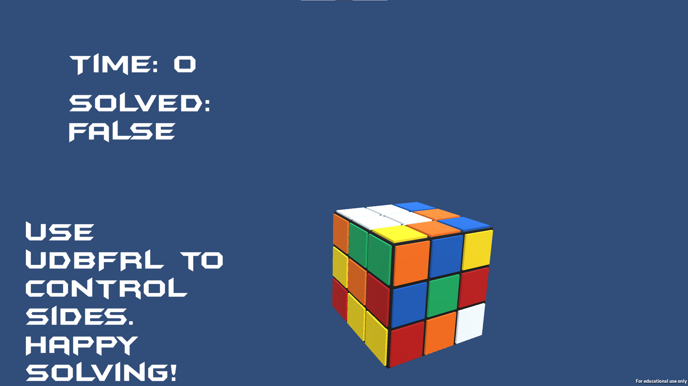

# RubiksCube (https://github.com/ethancedwards8/RubiksCube)

This game, programmed in C# with Unity in a little more than 500 lines of code, allows you to solve a Rubiks Cube virtually on a computer. 

I built this as my final project in my school's Game Design class. Upon entering the game, you are prompted to scramble the cube.
The scramble is created via a random number generator, and then parsed and appplied to the cube. After the scramble, the timer will start
and you can use the UDBFRL keys to rotate faces, and XYZ keys to rotate the cube itself. When the cube is solved, the timer will stop.

