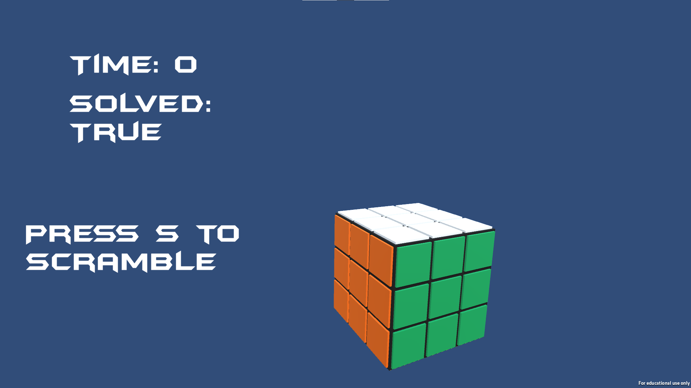

# RubiksCubeVR

Despite the name, the game does not support VR. I originally planned on building in support but ran out of time in the course. The cube works as expected with keyboard controls, however.

Play:

Scrambled:

